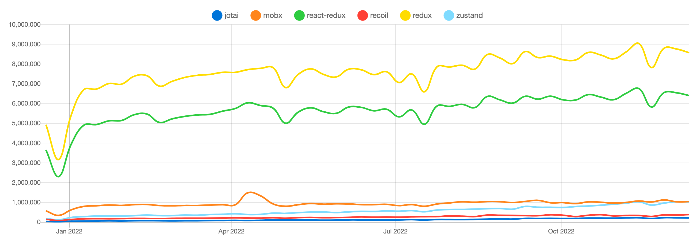

<br />

### 개요

이번에 면접을 진행하면서 질문으로 “주어진 과제에 전역상태관리로 Redux-toolkit 사용하였던데, 다른 상태관리 라이브러리도 많을 텐데 왜 Redux-toolkit을 사용했는지?”에 대한 질문을 받게 되었다. 경험해본 전역상태 관리 라이브러리에 대해서는 답변을 잘 하였지만, Jotai와 Zustand의 경우 경험해보지 못하고 사용해 본적이 없어서 거론 정도로 설명을 하고 끝나게 되어 이참에 전역상태관리에에 대한 부분을 집고 넘어가보자 이 글을 작성하게 되었다.

<br />

### 전체적인 공통점

React는 단방향 데이터 바인딩 방식([Flux Architecture](https://www.notion.so/Flux-Architecture-d6d19ec6eea8463ba46fcc0e318df882))이라 Props와 state를 다른 컨포넌트에서 사용하기 위해서는 `Props drilling`을 이용해야만 했다. Props drilling 방식을 이용하면 관리해야되는 컴포넌트가 많거나 하위 컴포넌트에서 사용하기 위해 불필요한 props를 전달해야되는 경우 등 불편함을 많이 느끼게 되었고, **전역적인 상태 관리의 필요성**이 대두 되었다.

<br />

### Context API

- `React 내장 API`로 외부 라이브러리 없이 상태 관리를 할 수 있다.(소규모 프로젝트에서 사용하기 적절)
- useReducer를 함께 사용하여 redux와 비슷한 형태로 상태관리를 할 수 있지만, `비동기처리가 어렵다`는 문제가 있다.
- `상태값을 변경`하면 Provider로 감싼 `모든 컴포넌트가 리레더링` 되는 문제가 발생하여 성능 최적화를 생각해 두고 사용해야 한다.

<br />

### Redux

- `Flux Architecture`를 참고하여 Redux가 만들어졌다.
- 비동기 처리를 하기 위해서는 다른 미들웨어 라이브러리를 사용하여야 한다.
- 보일러플레이트가 많아 러닝 커브가 높다.
- 현재까지 가장 있는 React 상태관리 라이브러리이다.
  - 이유로는 커뮤니티가 활발하고 디버깅이 쉽기 때문이다.
  - 개인적으로는 기존에 구축된 서비스의 경우 레거시 코드가 많아 레거시 코드에서 이용된 라이브러리가 리덕스이여서 그런것 같기도 하다.
- `Redux-toolkit`의 등장으로 그나마 보일러 플레이트가 줄어드러 사용이 간편해졌다.

<br />

### MobX

- Redux와 다르게 다수의 store를 사용할 수 있다.
- `객체지향적으로 설계`되어 Java Spring Framework와 유사한 아키텍처구조로 구성되어 있어 서버 개발자들에게 친숙한 형태이다.
- Redux에 비해 코드의 양이 적어 낮은 러닝 커브를 가지고 있다.
- devTools, 커뮤니티가 활발하지 않아 최신 레퍼런스를 찾아보는 것이 어려울 수도 있다.

<br />

### Recoil

- `Facebook`팀에서 만든 `React 전용 상태관리 라이브러리`여서 **React에 최적화** 되어 있다.
- 전역 상태 값도 `React의 state처럼 간단한` get/set 인터페이스로 사용할 수 있는 boilerplate-free API를 제공한다.(React 문법 친화적)
- `동시성 모드(Concureent Mode)`를 비롯한 다른 새로운 React의 기능들과 호환 가능성을 가진다.(React와 개발 방향성이 같음)
- **비동기처리를 별도의 라이브러리 설치없이 Recoil만으로 간단하게 처리**할 수 있다.
- 동일한 atom 값에 대해 `내부적으로 메모이즈된 값을 반환`하기 때문에 `속도가 빠르다.`(캐싱이 가능)
- `Redux`보다 보일러플레이트가 적고 러닝커브가 짧다.
- `상태를 분산적`으로 두어 `코드 스플리팅`이 가능하다.

<br />

### Jotai

- Recoil에서 영감을 받아 생긴 라이브러리 이다.
- 추가 `재렌더링이 없고` 상태가 react 내에 있어 `suspense와 동시 기능(concurrent features)의 이점`을 최대한 활용할 수 있다.
- 매우 최소한의 API를 가지고 있으며, `TypeScript 지향적`이다.
- `useState` 후크처럼 `사용이 간단`하지만 모든 상태에 전역적으로 액세스할 수 있고 파생된 상태를 구현하기 쉽고 추가 재렌더링이 자동으로 제거된다.

<br />

### Zustand

- Jotai를 만든 카토 다이시가 제작에 참여
- `한 개의 중앙에 집중된 형식의 스토어 구조를 활용`하면서, 상태를 정의하고 사용하는 방법이 단순
- React와 다르게 `자주 바뀌는 상태`를 `직접 제어`가 가능한 방법도 제공한다.(불변성을 고려하지 않아도 된다?)
- 코드의 양이 적어 보일러플레이트가 거의 없어, 러닝커버가 짧다.
- Redux Devtools를 사용할 수 있어서 디벙깅이 용이하다.

<br />

### 결론

**전역상태관리 라이브러리 같은 경우는 상황에 맞게 적절하게 사용하는게 맞다고 생각한다.**

**만약 더 추가적으로 고려해야될 사항이 있다면, 해당 라이브러리가 최신 레퍼런스가 얼마나 있는지 여부와 버전의 업그레이드가 자주 이루어지는지 여부를 체크해볼 것 같다. 최신 레퍼런스가 많다는 건 사람들이 많이 적용해보고 분위기를 타고잇다는 것을 확인 할 수 있을 것 같고, 자주 업데이트가 이루어지는 경우는 문제가 있거나, 정식버전화하려는 노력이 있다고 생각하기 때문이다.**

<br />

### 용어사전

Prop Drilling: 부모 컴포넌트에서 사용중인 State 값을 자식 컴포넌트 즉 하위 컴포넌트로 값을 전달하여 사용할때 사용하는 과정의 방식을 말함

<br />

### 참고링크

[jotai vs mobx vs react-redux vs recoil vs redux vs zustand | npm trends](https://npmtrends.com/jotai-vs-mobx-vs-react-redux-vs-recoil-vs-redux-vs-zustand)

[Context - React](https://ko.reactjs.org/docs/context.html)

[React Redux | React Redux](https://react-redux.js.org/)

[Redux Toolkit | Redux Toolkit](https://redux-toolkit.js.org/)

[MobX에 대하여 · MobX](https://ko.mobx.js.org/README.html)

[Recoil](https://recoiljs.org/ko/)

[Jotai, primitive and flexible state management for React](https://jotai.org/)

[Zustand](https://zustand-demo.pmnd.rs/)

[Recoil: React를 위한 상태 관리 라이브러리 | WIT블로그](https://wit.nts-corp.com/2022/10/13/6586)

[React 상태 관리 라이브러리 Zustand의 코드를 파헤쳐보자](https://ui.toast.com/posts/ko_20210812)

<br />

```toc

```
